<h1 align="center">Hi 👋, I;m Anthony Odhiambo  </h1>

Github Repository: [Click to Open the Project Github Repository](https://github.com/odhinto/Phase3Project.git)

Tableau Dashboard: [Click to Open the Tableau Dashboard](https://public.tableau.com/views/MovieData_17378656876300/Dashboard1?:language=en-US&publish=yes&:sid=&:redirect=auth&:display_count=n&:origin=viz_share_link)

# **Data Understanding**
## **Problem Statement**

Like most telecommunication companies, customer retention remains a critical challenge for **SyriaTel**. This is because as acquiring new customers is often more expensive than keeping existing ones. SyriaTel is experiencing customer churn where users discontinue their service. Identifying the patterns and factors that drive churn can help the company take proactive measures to reduce customer loss, enhance loyalty, and increase revenue.

The **primary objective** of this exercise is to leverage historical customer data with an aim to uncover key factors that predict churn

* Build a predictive model that accurately identifies customers at risk of churning
* Optimize model performance using feature engineering and tuning.

## **Dataset Overview**

The dataset has a mix of categorical data and numerical data. These can be summarized as follows:

**Customer Information**
* state - The U.S. state where the customer resides.
* account length - The number of days the customer has had an active account with SyriaTel.
* area code - The area code of the customer's phone number.
* phone number - The customer’s unique phone number (not useful for analysis and usually dropped).

**Subscription Plans**
* international plan - Indicates whether the customer has an international calling plan (yes or no).
* voice mail plan - Indicates whether the customer has a voicemail plan (yes or no).

**Usage Metrics**
* number vmail messages - The number of voicemail messages the customer has received.
* total day minutes - The total number of minutes the customer has spent on calls during the daytime.
* total day calls - The total number of calls made during the daytime.
* total day charge - The total charges incurred for calls made during the daytime.
* total eve minutes - The total number of minutes the customer has spent on calls during the evening.
* total eve calls - The total number of calls made during the evening.
* total eve charge - The total charges incurred for calls made during the evening.
* total night minutes - The total number of minutes the customer has spent on calls during the nighttime.
* total night calls - The total number of calls made during the nighttime.
* total night charge - The total charges incurred for calls made during the nighttime.
* total intl minutes - The total number of minutes the customer has spent on international calls.
* total intl calls - The total number of international calls made.
* total intl charge - The total charges incurred for international calls.

The task is to use these features to accurately predict customer churn.

# Data Cleaning
The data was checked for missing values and duplicates.

# **Exploratory Data Analysis**

Python, Tableau and MS Excel were used to explore and gather insights from the data.

  

        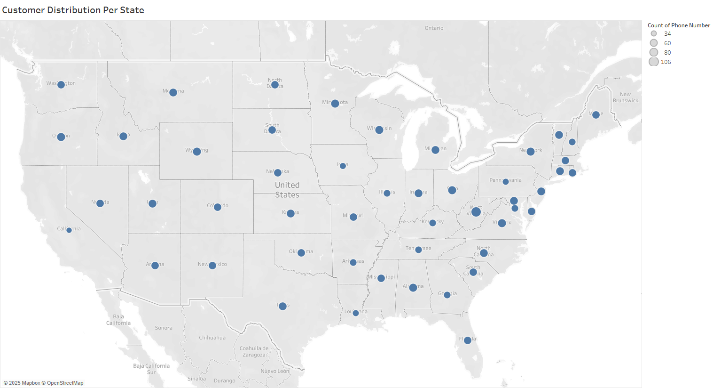
        
<em>Customer Distribution Per State</em>

    

The customers appear to be evenly distributed across all the states in USA.

  

        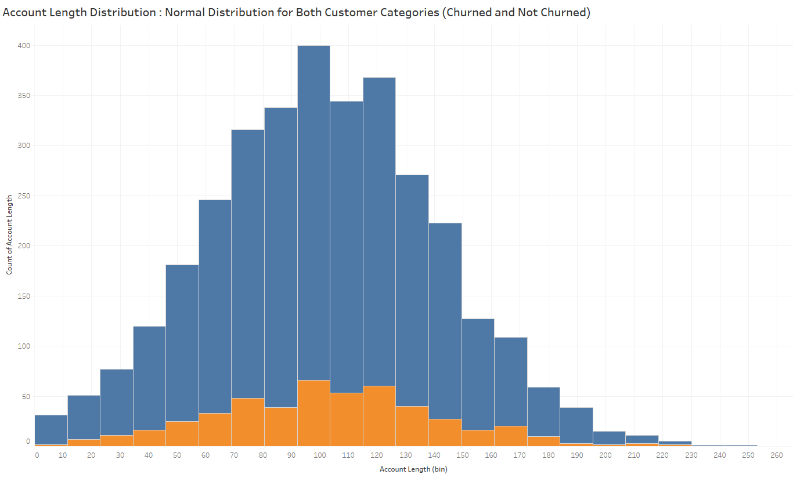
        
<em>Account Length Distribution in Days</em>

    

There appears to be normal distribution of the account length 

 

        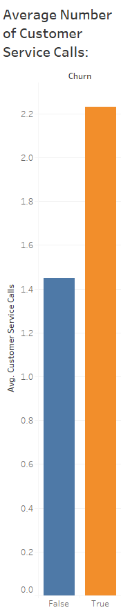
        
<em>Custome Service Calls</em>

    

There is high likelihood that a customer who makes more than 1 customer service call will churn.

 

        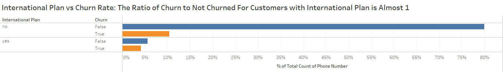
        
<em>International Plan vs Churn Rate</em>

    

The churn probability for customers with international plan appears high owing to the fact that for cutomers who have international plan, the ratio of churn to not churn is almost 1.

 

        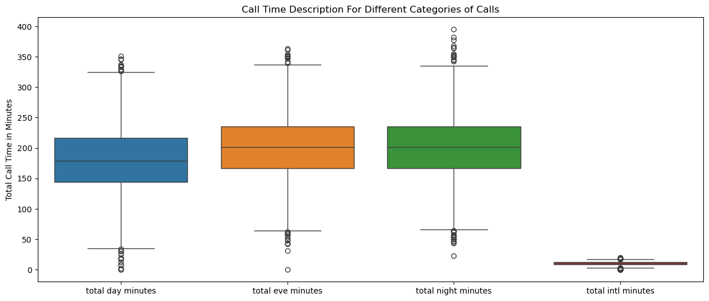
        
<em>Call Time Description</em>

    

Generally, the customers appear to have slightly longer calls in the evenings and at night with repect to day time calls.

 

        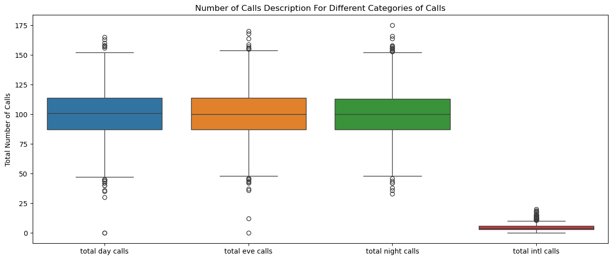
        
<em>Number of Calls Description</em>

    

The average number of calls by customers during the day, evening and at night is fairly balanced.

 

        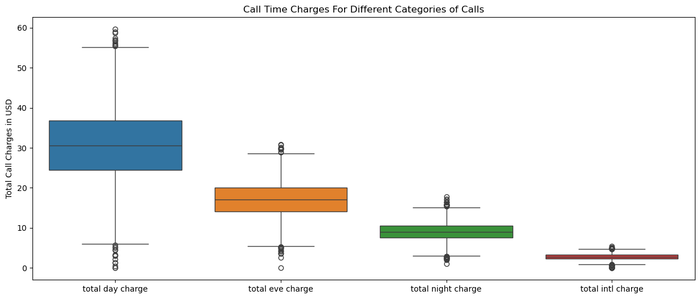
        
<em>Call Charges Description</em>

    

Despite call lengths being shorter during the day, corresponding call charges are much higher during the day. This must mean that the call rates for evening and night are much lower.

 

        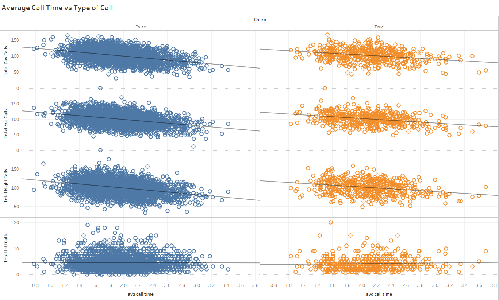
        
<em>Average Call Time vs TypeofCall</em>

    

On average, the number of calls a customer makes per day is inversely proportional to the average duration of calls the customer makes

  

        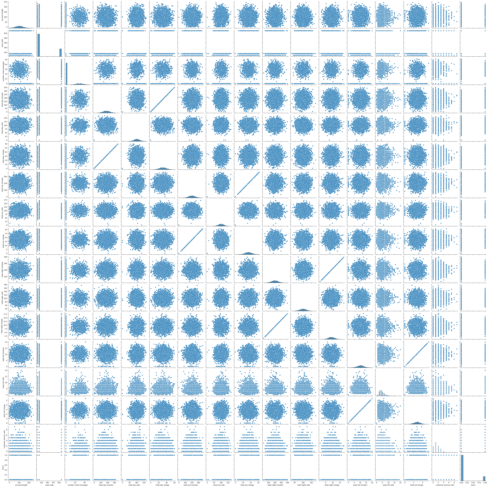
        
<em>Bivariate Analysis</em>

    

There seems to be 1:1 relationships between call charges and call minutes.

  

        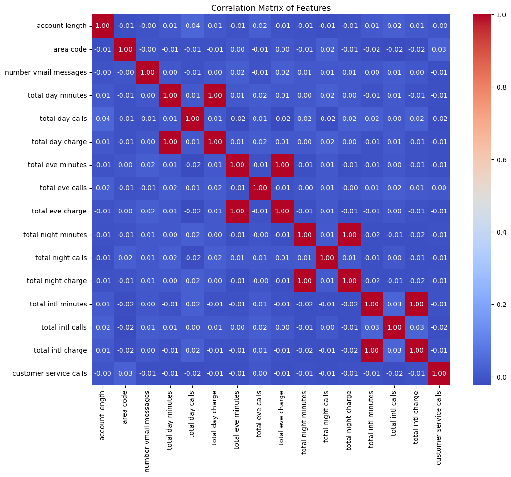
        
<em>Correlation Heat Map for The Original Features</em>

    

The correlation matrix for the original features is as follows as shown.

**Feature Engineering**:

Feature Engineering was used to try and make better sense of the data. The following features were derived:

* Total Minutes = total day minutes + total eve minutes + total night minutes
* Total Calls = total day calls + total eve calls + total night calls
* Avg Call Minutes Per Day = total minutes / total calls
* Avg Day Call Minutes Per Day = total day minutes / total day calls
* Avg Eve Call Minutes Per Day = total eve minutes / total eve calls
* Avg Night Call Minutes Per Day = total night minutes / total night calls
* Avg Intl Call Minutes Per Day = total intl minutes / total intl calls
* Day Call Ratio = total day calls / total calls
* Eve Call Ratio = total eve calls / total calls
* Night Call Ratio = total night calls / total calls
* Intl Call Ratio = total intl calls / total calls
* Vmail Ratio = number vmail messages / total calls
* Day Minutes Ratio = total day minutes / total minutes
* Eve Minutes Ratio = total eve minutes / total minutes
* Night Minutes Ratio = total night minutes / total minutes
* Intl Minutes Ratio = total intl minutes / total minutes
* Customer Service Call Intensity = customer service calls / account length
* Customer Service Calls Ratio = customer service calls / total calls

        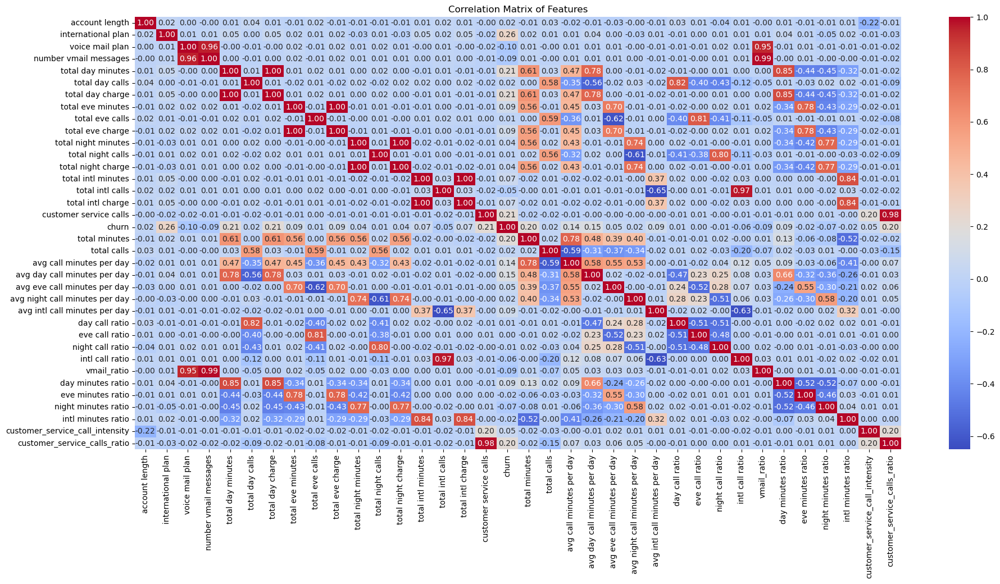
        
<em>Correlation Heat Map for The Engineered Features</em>

    

The correlation matrix for the original features is as follows as shown.

# Data Preprocessing
Categorical variables were encoded in preparation for modeling

# Modeling

Using a functional approach, we can check model evaluation performance for various classification techniques to find the most optimal model for predicting churn. Moreover, we can implement different features combinations to find the optimal features that best predict churn.

The following classification modeling techniques were randomly considered:

* Logistic Regression
* Random Forest
* Support Vector Machine
* Decision Tree
* K Nearest Neighbour
* AdaBoost Regression
* Ridge Regression
* Stochastic Gradient Descent

To also explore the effect of different feature combinations in the model performance, the following 3 dataframes were used:
* **Baseline**: Here, the data used to train and evaluate the models only have the **original fetaures**
* **Engineered**: Here, the data used to train and evaluate the models have both the **original features and all the engineered features**
* **Engineered Only**: Here, the data used to train and evaluate the models have **all the engineered features, but some of the original features have been removed**

This yielded the following performance metrics:

        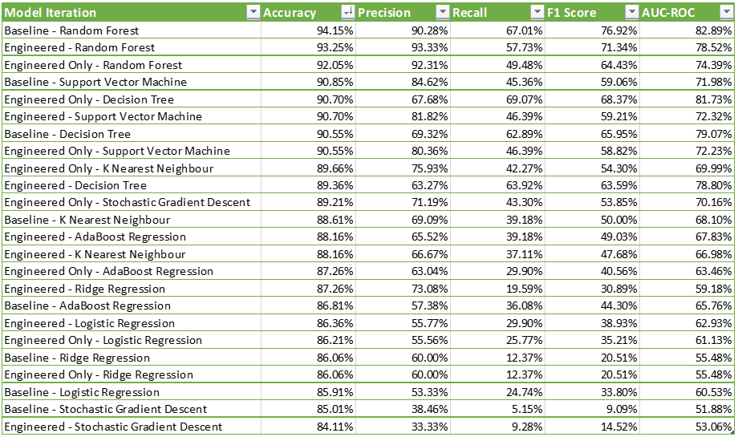
        
<em>Performance Metrics Sorted In Descending Order of Accracy</em>

    

The baseline Random Forest Model produced the highest Accuracy results

        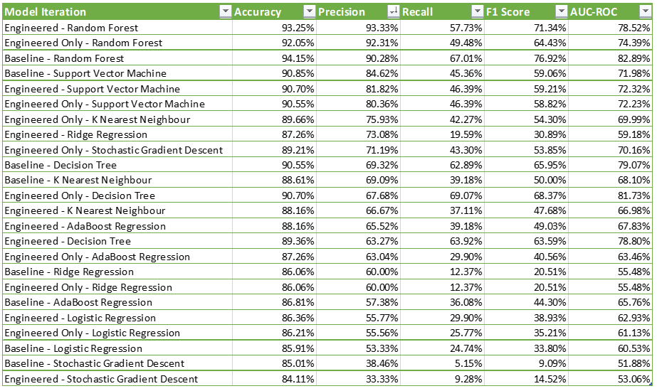
        
<em>Performance Metrics Sorted In Descending Order of Precision</em>

    

The Engineered Random Forest Model produced the highest Precision results

        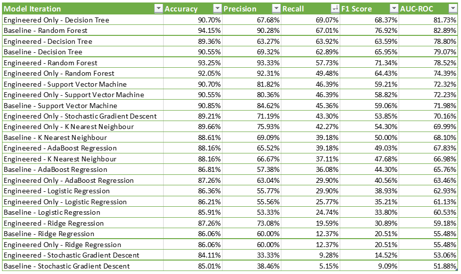
        
<em>Performance Metrics Sorted In Descending Order of Recall</em>

    

The Engineered-Only Decision Tree Model produced the highest Recall results

        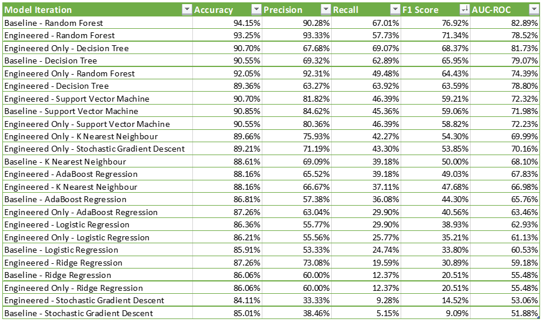
        
<em>Performance Metrics Sorted In Descending Order of F1 Score</em>

    

The Baseline Random Forest Model produced the highest Recall results

        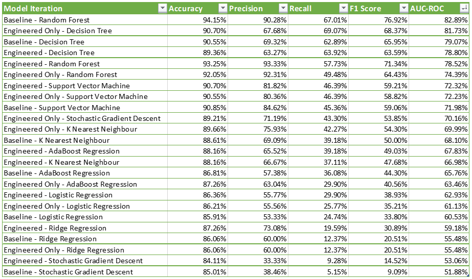
        
<em>Performance Metrics Sorted In Descending Order of AUC_ROC Score</em>

    

The Baseline Random Forest Model produced the highest AUC_ROC results
# **Conclusion**

1. **Genre Focus:**
   - Focus on highly rated genres 

2. **Director and Writer Partnerships:**
   - Invest in partnerships with proven directors and writers to enhance the likelihood of success.

3. **Casting Strategy:**
   - Include at least one A-list actor in high-budget projects while ensuring strong scripts and storytelling to retain audience satisfaction.

5. **Budget Allocation:**
   - Focus on low- to mid-budget films with a clear emphasis on maximizing profit margins.

6. **Long-Term Strategy:**
   - Continuously analyze audience preferences and emerging trends to adapt to shifting market demands.

    
# **Recommendation**
These recommendations provide a roadmap for achieving consistent profitability and success in the competitive movie industry.   Among the top 30 most expensive movies, Family, Fantasy, Musicals yield the highest profitability at relatively low budget.

 

        
        
<em>Average Production Budget vs Average Profitability by Genre</em>

    

For a start, our company should focus on producing this genre.

Average Production Budget vs Average Profitability by Genre